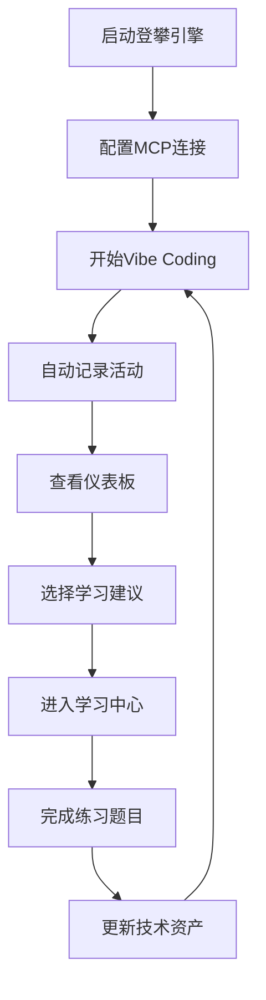
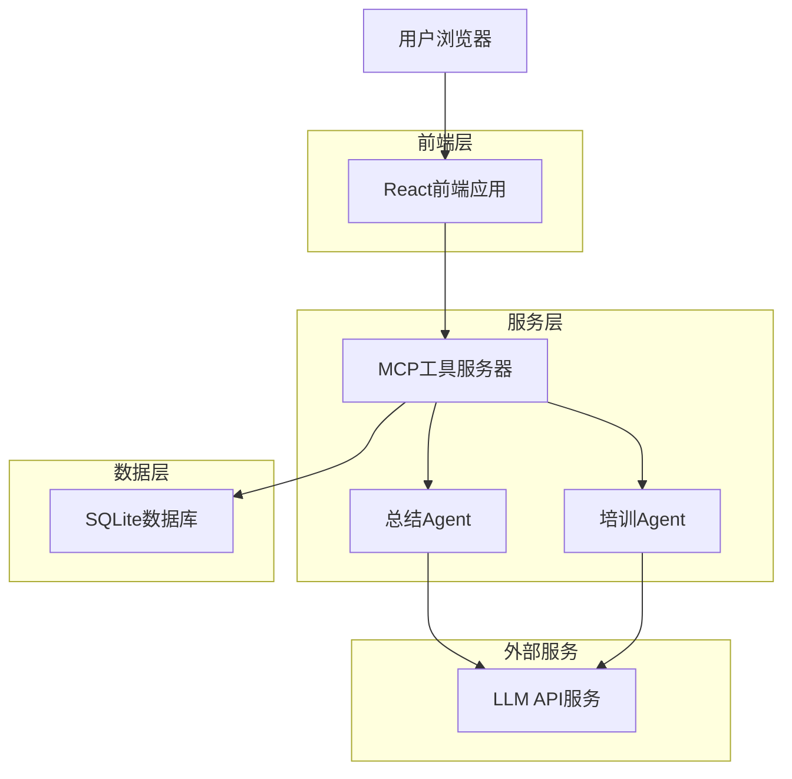
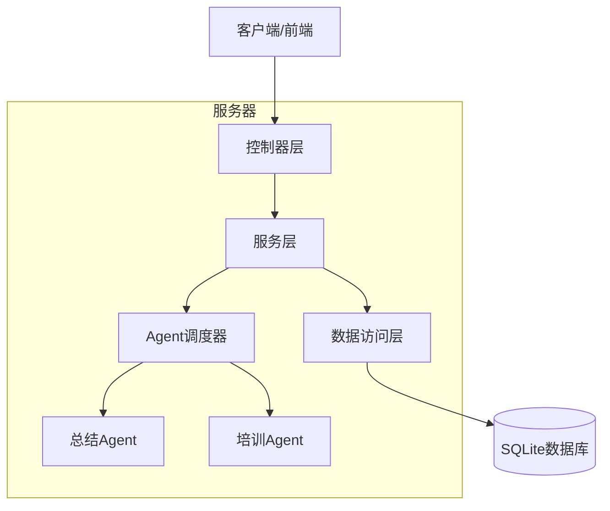
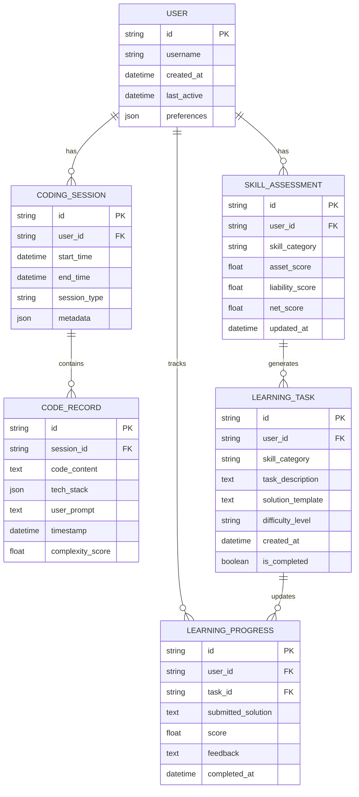

# 登攀引擎 (Climber Engine) 开发方案

## 1. 产品概述

登攀引擎是一个基于MCP协议的AI编程学习助手，通过无感记录用户的Vibe Coding过程，智能分析技术资产负债表，并提供个性化的学习指导。

产品核心价值：将AI辅助编程中产生的"技术债"转化为"技术杠杆"，实现用户编程能力的持续成长。

## 2. 核心功能

### 2.1 用户角色

| 角色 | 注册方式 | 核心权限 |
|------|----------|----------|
| 普通用户 | 本地安装启动 | 可使用所有核心功能，数据本地存储 |
| 开发者 | GitHub贡献 | 可访问开发者API，参与插件开发 |

### 2.2 功能模块

产品包含以下核心页面：
1. **仪表板页面**：技术资产负债表可视化，学习进度展示
2. **代码记录页面**：历史编程活动记录，代码片段管理
3. **学习中心页面**：个性化题目练习，知识点讲解
4. **设置页面**：MCP服务器配置，数据导入导出

### 2.3 页面详情

| 页面名称 | 模块名称 | 功能描述 |
|----------|----------|----------|
| 仪表板页面 | 技术资产图表 | 展示技术资产、负债、净资产的动态变化趋势 |
| 仪表板页面 | 技能树可视化 | 交互式技能图谱，显示已掌握和待学习的技术点 |
| 仪表板页面 | 学习建议 | 基于当前负债情况的个性化学习路径推荐 |
| 代码记录页面 | 活动时间线 | 按时间顺序展示编程活动记录 |
| 代码记录页面 | 代码片段库 | 分类管理生成的代码片段，支持搜索和标签 |
| 代码记录页面 | 技术栈分析 | 统计使用的框架、库和编程语言 |
| 学习中心页面 | 练习题目 | 根据技术负债生成的个性化编程题目 |
| 学习中心页面 | 知识讲解 | 基于用户项目的反向教学内容 |
| 学习中心页面 | 进度跟踪 | 学习完成情况和掌握程度评估 |
| 设置页面 | MCP配置 | 服务器地址、端口、认证设置 |
| 设置页面 | 数据管理 | 备份、恢复、清理本地数据 |

## 3. 核心流程

### 主要用户操作流程

1. **初始化配置**：用户启动登攀引擎，配置MCP服务器连接
2. **无感记录**：用户正常进行Vibe Coding，系统自动记录编程活动
3. **智能分析**：总结Agent定期分析记录，更新技术资产负债表
4. **主动学习**：用户查看仪表板，选择学习建议进入学习中心
5. **练习巩固**：完成培训Agent生成的个性化题目
6. **能力提升**：系统记录学习成果，更新技术净资产



## 4. 用户界面设计

### 4.1 设计风格

- **主色调**：深蓝色 (#1a365d) 和科技蓝 (#3182ce)
- **辅助色**：成功绿 (#38a169)、警告橙 (#dd6b20)、错误红 (#e53e3e)
- **按钮风格**：圆角现代风格，支持悬停和点击动效
- **字体**：系统默认字体栈，代码区域使用等宽字体
- **布局风格**：卡片式布局，左侧导航，响应式设计
- **图标风格**：线性图标，统一的视觉语言

### 4.2 页面设计概览

| 页面名称 | 模块名称 | UI元素 |
|----------|----------|--------|
| 仪表板页面 | 技术资产图表 | 环形图表显示资产负债比例，折线图展示历史趋势，使用Chart.js实现 |
| 仪表板页面 | 技能树可视化 | D3.js实现的交互式节点图，不同颜色表示掌握程度 |
| 代码记录页面 | 活动时间线 | 垂直时间轴布局，卡片式活动项，支持筛选和搜索 |
| 学习中心页面 | 练习题目 | 代码编辑器集成Monaco Editor，实时语法高亮 |
| 设置页面 | MCP配置 | 表单式配置界面，实时连接状态指示器 |

### 4.3 响应式设计

采用移动优先的响应式设计，支持桌面端、平板和移动端。桌面端为主要使用场景，移动端提供查看和简单操作功能。

## 5. 技术架构设计

### 5.1 整体架构



### 5.2 技术栈选择

- **前端**: React@18 + TypeScript + Vite + TailwindCSS + Zustand
- **后端**: Python FastAPI + uvicorn + SQLAlchemy
- **数据库**: SQLite (本地存储)
- **AI服务**: OpenAI API / Anthropic Claude API
- **构建工具**: uv (Python依赖管理) + Vite (前端构建)

### 5.3 路由定义

| 路由 | 用途 |
|------|------|
| / | 仪表板页面，显示技术资产负债表和学习概览 |
| /records | 代码记录页面，展示历史编程活动 |
| /learning | 学习中心页面，个性化题目和知识讲解 |
| /settings | 设置页面，MCP配置和数据管理 |

### 5.4 API定义

#### 5.4.1 核心API

**MCP数据记录**
```
POST /api/mcp/record
```

请求参数：
| 参数名 | 参数类型 | 是否必需 | 描述 |
|--------|----------|----------|------|
| session_id | string | true | 编程会话ID |
| code_content | string | true | 生成的代码内容 |
| tech_stack | array | true | 使用的技术栈 |
| user_prompt | string | true | 用户的原始需求 |
| timestamp | string | true | 记录时间戳 |

响应参数：
| 参数名 | 参数类型 | 描述 |
|--------|----------|------|
| success | boolean | 记录是否成功 |
| record_id | string | 记录唯一标识 |

**技术资产查询**
```
GET /api/assets/summary
```

响应示例：
```json
{
  "total_assets": 85,
  "total_liabilities": 23,
  "net_assets": 62,
  "growth_trend": [
    {"date": "2024-01-01", "assets": 80, "liabilities": 25},
    {"date": "2024-01-02", "assets": 85, "liabilities": 23}
  ]
}
```

### 5.5 服务器架构图



### 5.6 数据模型

#### 5.6.1 数据模型定义



#### 5.6.2 数据定义语言

**用户表 (users)**
```sql
-- 创建用户表
CREATE TABLE users (
    id TEXT PRIMARY KEY DEFAULT (lower(hex(randomblob(16)))),
    username TEXT UNIQUE NOT NULL,
    created_at TIMESTAMP DEFAULT CURRENT_TIMESTAMP,
    last_active TIMESTAMP DEFAULT CURRENT_TIMESTAMP,
    preferences TEXT DEFAULT '{}'
);

-- 创建索引
CREATE INDEX idx_users_username ON users(username);
CREATE INDEX idx_users_last_active ON users(last_active DESC);

-- 初始化数据
INSERT INTO users (username, preferences) VALUES 
('default_user', '{"theme": "dark", "language": "zh-CN"}');
```

**编程会话表 (coding_sessions)**
```sql
-- 创建编程会话表
CREATE TABLE coding_sessions (
    id TEXT PRIMARY KEY DEFAULT (lower(hex(randomblob(16)))),
    user_id TEXT NOT NULL,
    start_time TIMESTAMP DEFAULT CURRENT_TIMESTAMP,
    end_time TIMESTAMP,
    session_type TEXT DEFAULT 'vibe_coding',
    metadata TEXT DEFAULT '{}',
    FOREIGN KEY (user_id) REFERENCES users(id)
);

-- 创建索引
CREATE INDEX idx_sessions_user_id ON coding_sessions(user_id);
CREATE INDEX idx_sessions_start_time ON coding_sessions(start_time DESC);
```

**代码记录表 (code_records)**
```sql
-- 创建代码记录表
CREATE TABLE code_records (
    id TEXT PRIMARY KEY DEFAULT (lower(hex(randomblob(16)))),
    session_id TEXT NOT NULL,
    code_content TEXT NOT NULL,
    tech_stack TEXT NOT NULL, -- JSON格式存储技术栈数组
    user_prompt TEXT NOT NULL,
    timestamp TIMESTAMP DEFAULT CURRENT_TIMESTAMP,
    complexity_score REAL DEFAULT 0.0,
    FOREIGN KEY (session_id) REFERENCES coding_sessions(id)
);

-- 创建索引
CREATE INDEX idx_records_session_id ON code_records(session_id);
CREATE INDEX idx_records_timestamp ON code_records(timestamp DESC);
CREATE INDEX idx_records_complexity ON code_records(complexity_score DESC);
```

**技能评估表 (skill_assessments)**
```sql
-- 创建技能评估表
CREATE TABLE skill_assessments (
    id TEXT PRIMARY KEY DEFAULT (lower(hex(randomblob(16)))),
    user_id TEXT NOT NULL,
    skill_category TEXT NOT NULL,
    asset_score REAL DEFAULT 0.0,
    liability_score REAL DEFAULT 0.0,
    net_score REAL DEFAULT 0.0,
    updated_at TIMESTAMP DEFAULT CURRENT_TIMESTAMP,
    FOREIGN KEY (user_id) REFERENCES users(id),
    UNIQUE(user_id, skill_category)
);

-- 创建索引
CREATE INDEX idx_assessments_user_id ON skill_assessments(user_id);
CREATE INDEX idx_assessments_category ON skill_assessments(skill_category);
CREATE INDEX idx_assessments_net_score ON skill_assessments(net_score DESC);
```

## 6. 开发计划

### 6.1 开发阶段

#### 第一阶段：核心基础设施 (4周)

**Week 1-2: 后端基础**
- 搭建FastAPI项目结构
- 实现SQLite数据库模型
- 开发MCP协议接口
- 实现基础的数据记录API

**Week 3-4: 前端框架**
- 搭建React + TypeScript项目
- 实现基础路由和布局
- 开发仪表板页面框架
- 集成状态管理(Zustand)

#### 第二阶段：核心功能开发 (6周)

**Week 5-6: 数据记录与分析**
- 完善MCP数据记录功能
- 实现代码复杂度分析算法
- 开发技术栈识别逻辑
- 实现基础的资产负债计算

**Week 7-8: 前端核心页面**
- 完成仪表板数据可视化
- 实现代码记录页面
- 开发技能树可视化组件
- 集成图表库(Chart.js, D3.js)

**Week 9-10: 智能Agent开发**
- 实现总结Agent基础逻辑
- 开发LLM API集成
- 实现技术债务分析算法
- 开发培训Agent题目生成

#### 第三阶段：学习功能完善 (4周)

**Week 11-12: 学习中心**
- 完成学习中心页面开发
- 集成代码编辑器(Monaco Editor)
- 实现题目评分系统
- 开发学习进度跟踪

**Week 13-14: 系统优化**
- 性能优化和缓存策略
- 用户体验优化
- 错误处理和日志系统
- 数据备份和恢复功能

#### 第四阶段：测试与发布 (2周)

**Week 15: 测试**
- 单元测试和集成测试
- 用户接受度测试
- 性能压力测试
- 安全性测试

**Week 16: 发布准备**
- 文档编写和完善
- 部署脚本和Docker化
- 发布包构建
- 开源社区准备

### 6.2 技术风险评估

| 风险项 | 风险等级 | 缓解策略 |
|--------|----------|----------|
| LLM API稳定性 | 中 | 实现多个API提供商支持，本地缓存机制 |
| 代码分析准确性 | 高 | 建立测试数据集，持续优化算法 |
| 前端性能 | 中 | 虚拟化长列表，懒加载，代码分割 |
| 数据隐私 | 低 | 本地存储，用户数据加密 |

### 6.3 质量保证

- **代码规范**: 使用ESLint + Prettier (前端), Black + isort (后端)
- **测试覆盖**: 目标80%以上的测试覆盖率
- **性能监控**: 集成性能监控工具，设置关键指标阈值
- **安全审计**: 定期进行依赖安全扫描

## 7. 部署方案

### 7.1 本地开发环境

```bash
# 后端启动
cd backend
uv venv
source .venv/bin/activate  # Windows: .venv\Scripts\activate
uv pip install -r requirements.txt
uvicorn main:app --reload --port 8000

# 前端启动
cd frontend
npm install
npm run dev
```

### 7.2 Docker部署

```dockerfile
# Dockerfile.backend
FROM python:3.11-slim
WORKDIR /app
COPY requirements.txt .
RUN pip install uv && uv pip install -r requirements.txt
COPY . .
EXPOSE 8000
CMD ["uvicorn", "main:app", "--host", "0.0.0.0", "--port", "8000"]

# Dockerfile.frontend
FROM node:18-alpine
WORKDIR /app
COPY package*.json ./
RUN npm ci --only=production
COPY . .
RUN npm run build
EXPOSE 3000
CMD ["npm", "run", "preview"]
```

### 7.3 一键部署脚本

```bash
#!/bin/bash
# deploy.sh
echo "正在构建登攀引擎..."
docker-compose up -d --build
echo "部署完成！访问 http://localhost:3000"
```

## 8. 后续扩展计划

### 8.1 短期扩展 (3-6个月)
- 支持更多编程语言的代码分析
- 集成更多LLM提供商
- 开发移动端应用
- 实现团队协作功能

### 8.2 长期规划 (6-12个月)
- 构建开发者生态和插件系统
- 实现云端同步功能
- 开发AI导师个性化定制
- 建立学习社区和知识分享平台

---

**开发原则**: 本地优先、隐私保护、开源开放、持续迭代

**成功指标**: 用户技术净资产增长率、学习完成率、代码质量提升度、用户留存率