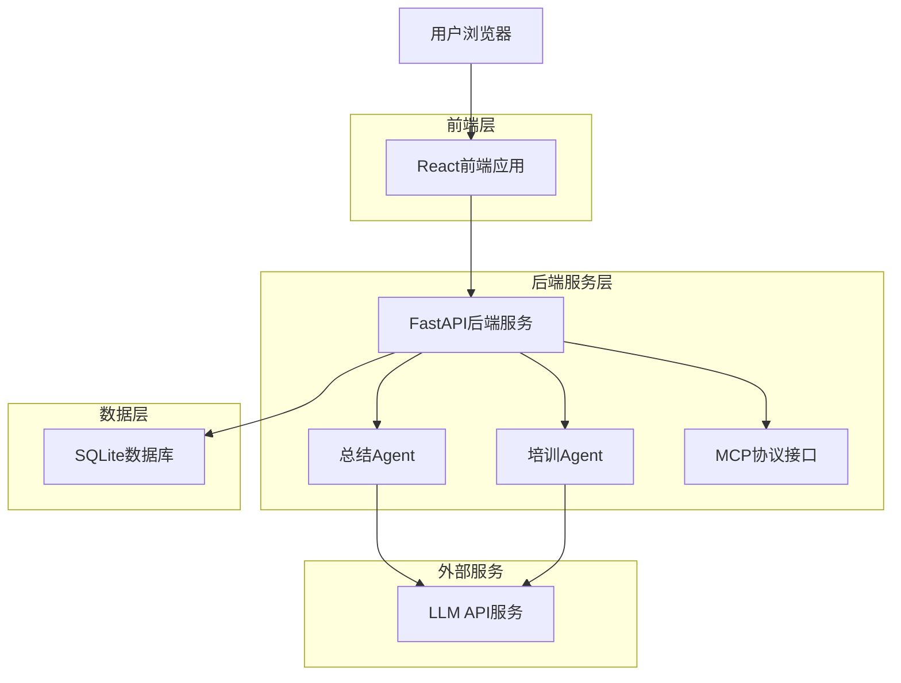
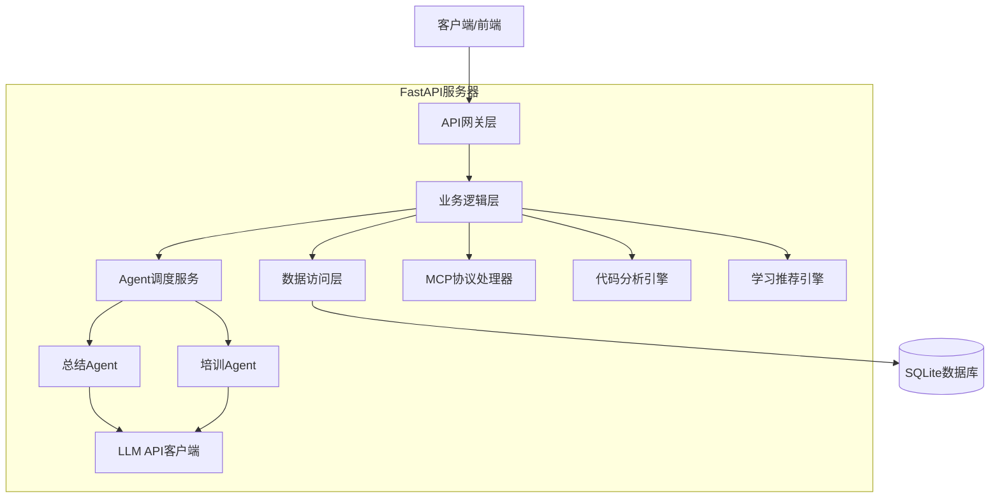
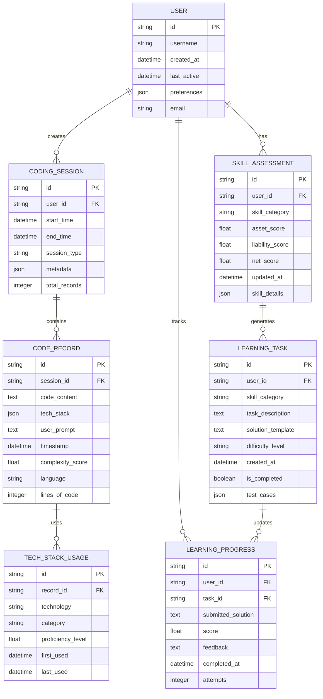

# 登攀引擎技术架构文档

## 1. 架构设计



## 2. 技术描述

- **前端**: React@18 + TypeScript + Vite + TailwindCSS + Zustand + Chart.js + D3.js + Monaco Editor
- **后端**: Python FastAPI + uvicorn + SQLAlchemy + asyncio
- **数据库**: SQLite (本地存储)
- **AI服务**: OpenAI API / Anthropic Claude API
- **协议**: MCP (Model Context Protocol)
- **构建工具**: uv (Python依赖管理) + Vite (前端构建)

## 3. 路由定义

| 路由 | 用途 |
|------|------|
| / | 仪表板页面，显示技术资产负债表和学习概览 |
| /records | 代码记录页面，展示历史编程活动和代码片段管理 |
| /learning | 学习中心页面，个性化题目练习和知识点讲解 |
| /settings | 设置页面，MCP服务器配置和数据管理 |

## 4. API定义

### 4.1 核心API

**MCP数据记录接口**
```
POST /api/mcp/record
```

请求参数：
| 参数名 | 参数类型 | 是否必需 | 描述 |
|--------|----------|----------|------|
| session_id | string | true | 编程会话唯一标识 |
| code_content | string | true | AI生成的代码内容 |
| tech_stack | array | true | 使用的技术栈列表 |
| user_prompt | string | true | 用户的原始需求描述 |
| timestamp | string | true | 记录时间戳 |
| complexity_score | number | false | 代码复杂度评分 |

响应参数：
| 参数名 | 参数类型 | 描述 |
|--------|----------|------|
| success | boolean | 记录操作是否成功 |
| record_id | string | 生成的记录唯一标识 |
| message | string | 操作结果消息 |

示例：
```json
{
  "session_id": "sess_123456",
  "code_content": "import pandas as pd\ndf = pd.read_csv('data.csv')",
  "tech_stack": ["python", "pandas", "data-analysis"],
  "user_prompt": "帮我读取CSV文件并进行数据分析",
  "timestamp": "2024-01-15T10:30:00Z"
}
```

**技术资产查询接口**
```
GET /api/assets/summary
```

响应参数：
| 参数名 | 参数类型 | 描述 |
|--------|----------|------|
| total_assets | number | 总技术资产分数 |
| total_liabilities | number | 总技术负债分数 |
| net_assets | number | 技术净资产分数 |
| growth_trend | array | 历史增长趋势数据 |

**学习任务生成接口**
```
POST /api/learning/generate-task
```

请求参数：
| 参数名 | 参数类型 | 是否必需 | 描述 |
|--------|----------|----------|------|
| user_id | string | true | 用户标识 |
| skill_category | string | true | 技能类别 |
| difficulty_level | string | false | 难度等级 (easy/medium/hard) |

响应参数：
| 参数名 | 参数类型 | 描述 |
|--------|----------|------|
| task_id | string | 任务唯一标识 |
| description | string | 任务描述 |
| solution_template | string | 解决方案模板 |
| expected_output | string | 期望输出 |

## 5. 服务器架构图



## 6. 数据模型

### 6.1 数据模型定义



### 6.2 数据定义语言

**用户表 (users)**
```sql
-- 创建用户表
CREATE TABLE users (
    id TEXT PRIMARY KEY DEFAULT (lower(hex(randomblob(16)))),
    username TEXT UNIQUE NOT NULL,
    email TEXT UNIQUE,
    created_at TIMESTAMP DEFAULT CURRENT_TIMESTAMP,
    last_active TIMESTAMP DEFAULT CURRENT_TIMESTAMP,
    preferences TEXT DEFAULT '{}'
);

-- 创建索引
CREATE INDEX idx_users_username ON users(username);
CREATE INDEX idx_users_email ON users(email);
CREATE INDEX idx_users_last_active ON users(last_active DESC);

-- 初始化数据
INSERT INTO users (username, email, preferences) VALUES 
('default_user', 'user@example.com', '{"theme": "dark", "language": "zh-CN", "notifications": true}');
```

**编程会话表 (coding_sessions)**
```sql
-- 创建编程会话表
CREATE TABLE coding_sessions (
    id TEXT PRIMARY KEY DEFAULT (lower(hex(randomblob(16)))),
    user_id TEXT NOT NULL,
    start_time TIMESTAMP DEFAULT CURRENT_TIMESTAMP,
    end_time TIMESTAMP,
    session_type TEXT DEFAULT 'vibe_coding',
    metadata TEXT DEFAULT '{}',
    total_records INTEGER DEFAULT 0,
    FOREIGN KEY (user_id) REFERENCES users(id) ON DELETE CASCADE
);

-- 创建索引
CREATE INDEX idx_sessions_user_id ON coding_sessions(user_id);
CREATE INDEX idx_sessions_start_time ON coding_sessions(start_time DESC);
CREATE INDEX idx_sessions_type ON coding_sessions(session_type);
```

**代码记录表 (code_records)**
```sql
-- 创建代码记录表
CREATE TABLE code_records (
    id TEXT PRIMARY KEY DEFAULT (lower(hex(randomblob(16)))),
    session_id TEXT NOT NULL,
    code_content TEXT NOT NULL,
    tech_stack TEXT NOT NULL, -- JSON格式存储技术栈数组
    user_prompt TEXT NOT NULL,
    timestamp TIMESTAMP DEFAULT CURRENT_TIMESTAMP,
    complexity_score REAL DEFAULT 0.0,
    language TEXT DEFAULT 'unknown',
    lines_of_code INTEGER DEFAULT 0,
    FOREIGN KEY (session_id) REFERENCES coding_sessions(id) ON DELETE CASCADE
);

-- 创建索引
CREATE INDEX idx_records_session_id ON code_records(session_id);
CREATE INDEX idx_records_timestamp ON code_records(timestamp DESC);
CREATE INDEX idx_records_complexity ON code_records(complexity_score DESC);
CREATE INDEX idx_records_language ON code_records(language);

-- 创建全文搜索索引
CREATE VIRTUAL TABLE code_records_fts USING fts5(
    code_content, user_prompt, content=code_records, content_rowid=rowid
);
```

**技能评估表 (skill_assessments)**
```sql
-- 创建技能评估表
CREATE TABLE skill_assessments (
    id TEXT PRIMARY KEY DEFAULT (lower(hex(randomblob(16)))),
    user_id TEXT NOT NULL,
    skill_category TEXT NOT NULL,
    asset_score REAL DEFAULT 0.0,
    liability_score REAL DEFAULT 0.0,
    net_score REAL DEFAULT 0.0,
    updated_at TIMESTAMP DEFAULT CURRENT_TIMESTAMP,
    skill_details TEXT DEFAULT '{}', -- JSON格式存储详细技能信息
    FOREIGN KEY (user_id) REFERENCES users(id) ON DELETE CASCADE,
    UNIQUE(user_id, skill_category)
);

-- 创建索引
CREATE INDEX idx_assessments_user_id ON skill_assessments(user_id);
CREATE INDEX idx_assessments_category ON skill_assessments(skill_category);
CREATE INDEX idx_assessments_net_score ON skill_assessments(net_score DESC);
CREATE INDEX idx_assessments_updated ON skill_assessments(updated_at DESC);
```

**学习任务表 (learning_tasks)**
```sql
-- 创建学习任务表
CREATE TABLE learning_tasks (
    id TEXT PRIMARY KEY DEFAULT (lower(hex(randomblob(16)))),
    user_id TEXT NOT NULL,
    skill_category TEXT NOT NULL,
    task_description TEXT NOT NULL,
    solution_template TEXT,
    difficulty_level TEXT DEFAULT 'medium' CHECK (difficulty_level IN ('easy', 'medium', 'hard')),
    created_at TIMESTAMP DEFAULT CURRENT_TIMESTAMP,
    is_completed BOOLEAN DEFAULT FALSE,
    test_cases TEXT DEFAULT '[]', -- JSON格式存储测试用例
    FOREIGN KEY (user_id) REFERENCES users(id) ON DELETE CASCADE
);

-- 创建索引
CREATE INDEX idx_tasks_user_id ON learning_tasks(user_id);
CREATE INDEX idx_tasks_category ON learning_tasks(skill_category);
CREATE INDEX idx_tasks_difficulty ON learning_tasks(difficulty_level);
CREATE INDEX idx_tasks_completed ON learning_tasks(is_completed);
CREATE INDEX idx_tasks_created ON learning_tasks(created_at DESC);
```

**学习进度表 (learning_progress)**
```sql
-- 创建学习进度表
CREATE TABLE learning_progress (
    id TEXT PRIMARY KEY DEFAULT (lower(hex(randomblob(16)))),
    user_id TEXT NOT NULL,
    task_id TEXT NOT NULL,
    submitted_solution TEXT,
    score REAL DEFAULT 0.0,
    feedback TEXT,
    completed_at TIMESTAMP DEFAULT CURRENT_TIMESTAMP,
    attempts INTEGER DEFAULT 1,
    FOREIGN KEY (user_id) REFERENCES users(id) ON DELETE CASCADE,
    FOREIGN KEY (task_id) REFERENCES learning_tasks(id) ON DELETE CASCADE
);

-- 创建索引
CREATE INDEX idx_progress_user_id ON learning_progress(user_id);
CREATE INDEX idx_progress_task_id ON learning_progress(task_id);
CREATE INDEX idx_progress_score ON learning_progress(score DESC);
CREATE INDEX idx_progress_completed ON learning_progress(completed_at DESC);
```

**技术栈使用记录表 (tech_stack_usage)**
```sql
-- 创建技术栈使用记录表
CREATE TABLE tech_stack_usage (
    id TEXT PRIMARY KEY DEFAULT (lower(hex(randomblob(16)))),
    record_id TEXT NOT NULL,
    technology TEXT NOT NULL,
    category TEXT NOT NULL, -- 'language', 'framework', 'library', 'tool'
    proficiency_level REAL DEFAULT 0.0,
    first_used TIMESTAMP DEFAULT CURRENT_TIMESTAMP,
    last_used TIMESTAMP DEFAULT CURRENT_TIMESTAMP,
    FOREIGN KEY (record_id) REFERENCES code_records(id) ON DELETE CASCADE
);

-- 创建索引
CREATE INDEX idx_tech_usage_record_id ON tech_stack_usage(record_id);
CREATE INDEX idx_tech_usage_technology ON tech_stack_usage(technology);
CREATE INDEX idx_tech_usage_category ON tech_stack_usage(category);
CREATE INDEX idx_tech_usage_proficiency ON tech_stack_usage(proficiency_level DESC);
CREATE INDEX idx_tech_usage_last_used ON tech_stack_usage(last_used DESC);

-- 初始化技术栈分类数据
INSERT INTO tech_stack_usage (record_id, technology, category, proficiency_level) VALUES 
('demo_record_1', 'Python', 'language', 0.8),
('demo_record_1', 'FastAPI', 'framework', 0.6),
('demo_record_1', 'SQLAlchemy', 'library', 0.5);
```

**触发器和视图**
```sql
-- 创建触发器：自动更新会话记录数
CREATE TRIGGER update_session_records 
AFTER INSERT ON code_records
BEGIN
    UPDATE coding_sessions 
    SET total_records = total_records + 1 
    WHERE id = NEW.session_id;
END;

-- 创建视图：用户技术栈统计
CREATE VIEW user_tech_stack_summary AS
SELECT 
    u.id as user_id,
    u.username,
    tsu.technology,
    tsu.category,
    AVG(tsu.proficiency_level) as avg_proficiency,
    COUNT(*) as usage_count,
    MAX(tsu.last_used) as last_used
FROM users u
JOIN coding_sessions cs ON u.id = cs.user_id
JOIN code_records cr ON cs.id = cr.session_id
JOIN tech_stack_usage tsu ON cr.id = tsu.record_id
GROUP BY u.id, tsu.technology, tsu.category;

-- 创建视图：用户学习进度概览
CREATE VIEW user_learning_overview AS
SELECT 
    u.id as user_id,
    u.username,
    COUNT(DISTINCT lt.id) as total_tasks,
    COUNT(DISTINCT CASE WHEN lt.is_completed THEN lt.id END) as completed_tasks,
    AVG(lp.score) as avg_score,
    MAX(lp.completed_at) as last_activity
FROM users u
LEFT JOIN learning_tasks lt ON u.id = lt.user_id
LEFT JOIN learning_progress lp ON lt.id = lp.task_id
GROUP BY u.id, u.username;
```

## 7. 核心算法设计

### 7.1 技术债务评估算法

```python
def calculate_technical_debt(code_record, user_history):
    """
    计算代码记录的技术债务分数
    
    Args:
        code_record: 代码记录对象
        user_history: 用户历史技能数据
    
    Returns:
        dict: 包含资产、负债、净资产分数
    """
    # 代码复杂度权重
    complexity_weight = min(code_record.complexity_score / 10.0, 1.0)
    
    # 技术栈熟悉度
    tech_familiarity = calculate_tech_familiarity(code_record.tech_stack, user_history)
    
    # 资产分数 = 代码价值 * 熟悉度
    asset_score = complexity_weight * tech_familiarity
    
    # 负债分数 = 代码复杂度 * (1 - 熟悉度)
    liability_score = complexity_weight * (1 - tech_familiarity)
    
    # 净资产 = 资产 - 负债
    net_score = asset_score - liability_score
    
    return {
        'asset_score': asset_score,
        'liability_score': liability_score,
        'net_score': net_score
    }
```

### 7.2 学习任务生成算法

```python
def generate_learning_task(user_id, skill_gaps):
    """
    基于用户技能缺口生成个性化学习任务
    
    Args:
        user_id: 用户ID
        skill_gaps: 技能缺口列表
    
    Returns:
        dict: 生成的学习任务
    """
    # 选择优先级最高的技能缺口
    target_skill = max(skill_gaps, key=lambda x: x['priority'])
    
    # 根据用户当前水平调整难度
    difficulty = determine_difficulty(user_id, target_skill)
    
    # 生成任务描述和测试用例
    task_prompt = create_task_prompt(target_skill, difficulty)
    
    return {
        'skill_category': target_skill['category'],
        'difficulty_level': difficulty,
        'task_description': task_prompt['description'],
        'solution_template': task_prompt['template'],
        'test_cases': task_prompt['test_cases']
    }
```

## 8. 性能优化策略

### 8.1 数据库优化
- 使用适当的索引策略
- 实现查询结果缓存
- 定期清理过期数据
- 使用连接池管理数据库连接

### 8.2 前端性能优化
- 实现虚拟滚动处理大量数据
- 使用React.memo和useMemo优化渲染
- 代码分割和懒加载
- 图片和资源压缩

### 8.3 API性能优化
- 实现响应缓存机制
- 使用异步处理长时间任务
- 实现请求限流和防抖
- 优化数据序列化性能

## 9. 安全性设计

### 9.1 数据安全
- 本地数据加密存储
- API密钥安全管理
- 用户隐私数据保护
- 定期安全审计

### 9.2 系统安全
- 输入验证和SQL注入防护
- XSS攻击防护
- CSRF令牌验证
- 安全的会话管理

## 10. 监控和日志

### 10.1 系统监控
- API响应时间监控
- 数据库性能监控
- 内存和CPU使用率监控
- 错误率和异常监控

### 10.2 日志管理
- 结构化日志记录
- 日志级别管理
- 日志轮转和归档
- 敏感信息脱敏